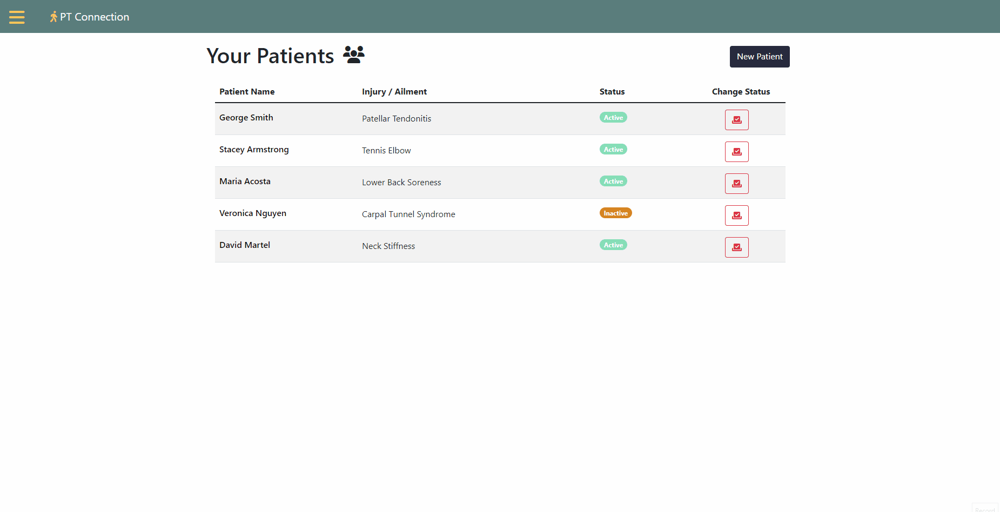
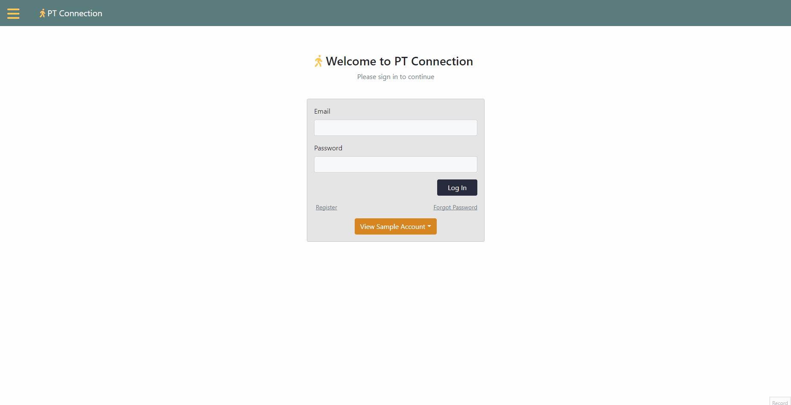

# pt-connection

A full stack JavaScript application for physical therapists who want to digitally communicate at-home exercises to their patients.

## Why I Built This

As someone who went through physical therapy and was headed into the field as a career, patient access to assigned exercises was a need I thought should be addressed. Patients could easily lose exercise printouts and/or emails in between physical therapy sessions, making it difficult to keep up with their rehabilitation.

## Technologies Used

- React.js
- Webpack
- Bootstrap 5
- SendGrid Email API - [Documentation]
- Node.js
- Express.js
- PostgreSQL
- HTML5
- CSS3
- JavaScript ES6
- Dokku

## Live Demo

Try this application live at - https://pt-connection.cmartin.dev

## Features

- Physical Therapists can create a patient profile
- Physical Therapists can create an exercise profile
- Physical Therapists can review patient profiles
- Physical Therapists can review exercise profiles
- Physical Therapists can update patient profiles
- Physical Therapists can update exercise profiles
- Physical Therapists can delete patient profiles
- Physical Therapists can delete exercises profiles
- Physical Therapists can assign exercises to a patient
- Physical Therapists can update assigned exercises
- Physical Therapists remove assigned exercises from a patient
- Patients can review assigned exercises
- Patients can create feedback on assigned exercises
- Patients can update/delete feedback on assigned exercises
- Physical Therapists can review exercise feedback from patients

## Preview





## Stretch Features

I would like to implement the following:

- Physical therapist and patient can exchange messages regarding assigned exercises.
- Physical therapist can assign multiple exercises at once.

## Development

### System Requirements

- Node.js 18 or higher
- NPM 8 or higher
- PostgreSQL 8 or higher

### Getting Started

1. Clone the repository.

    ```shell
    git clone https://github.com/cody-martin8/final-project
    ```

2. Install all dependencies with NPM.

    ```shell
    npm install
    ```

3. Create new .env file. Copy over content from .env.example. Where it says 'changeMe' in DATABASE_URL, change to 'finalProject'.

4. Start the PostgreSQL database server.

    ```shell
    sudo service postgresql start
    ```

5. Import the example database to PostgreSQL.

    ```shell
    npm run db:import
    ```

6. Start the project. Once started you can view the application by opening http://localhost:3000 in your browser.

    ```shell
    npm run dev
    ```
[Documentation]: https://docs.sendgrid.com/for-developers
